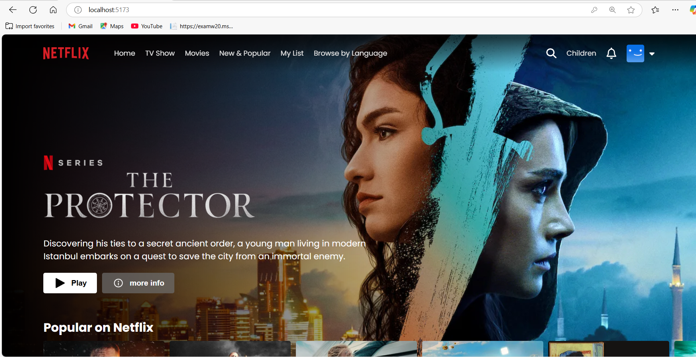
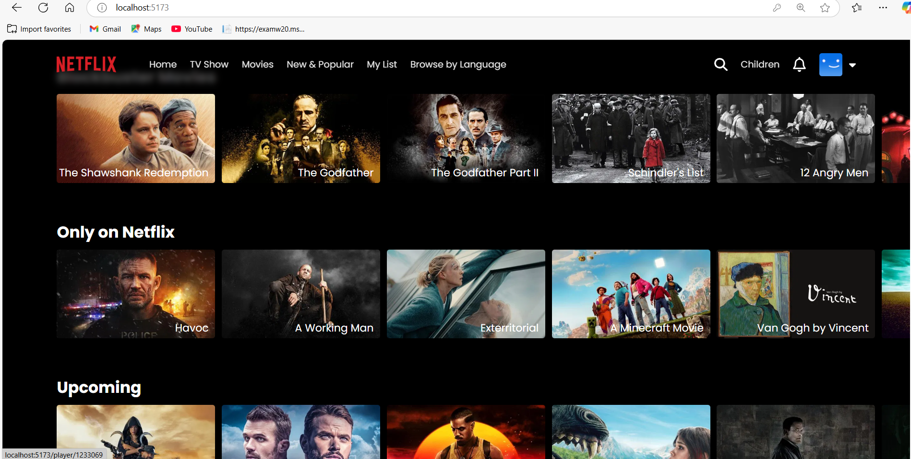
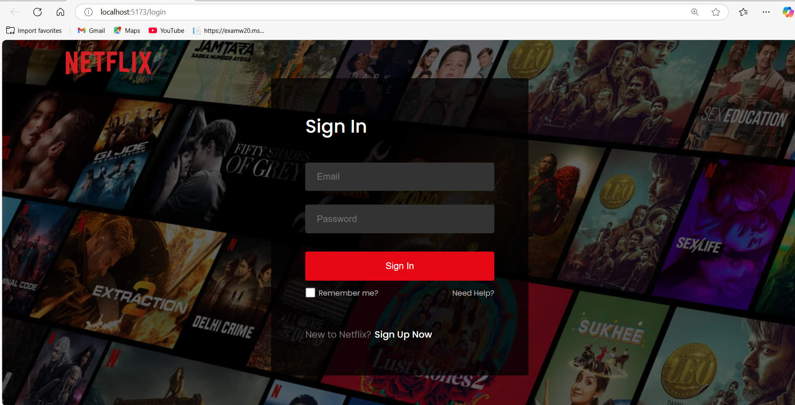
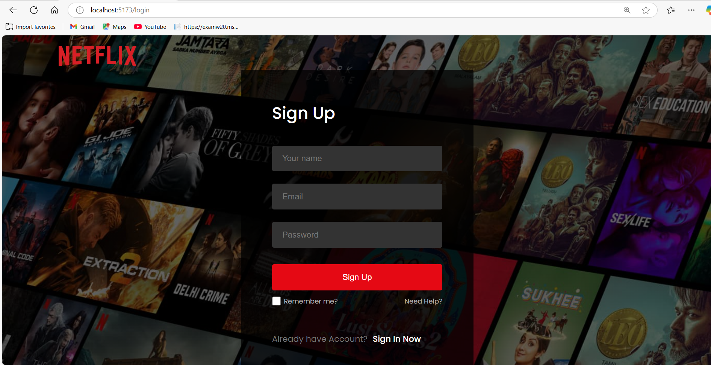
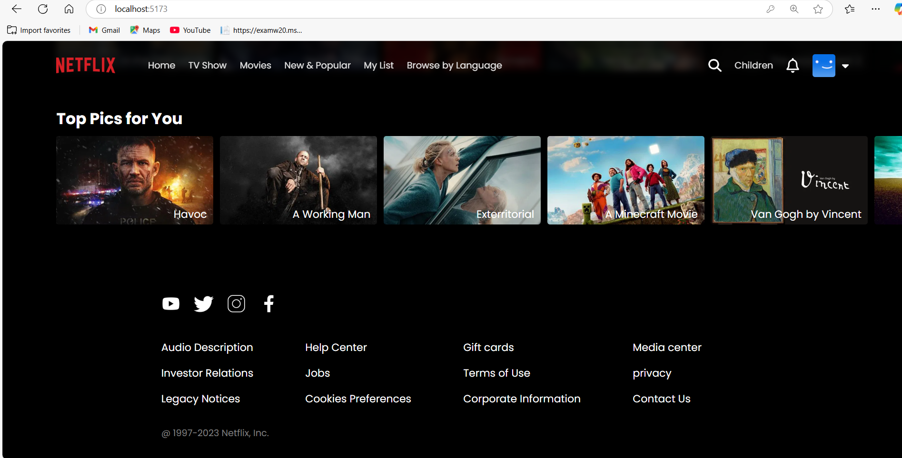

# Netflix Clone Application

This is a Netflix Clone built using **React** and **Vite**, designed to replicate key features of the Netflix UI. It includes user authentication via **Firebase**, navigation with **React Router**, and dynamic content rendering using the **TMDB (The Movie Database)** API. The project is structured for scalability and modern development with a fast dev server powered by Vite.

## Key Technologies

- **Frontend**: React.js (via Vite)
- **Routing**: React Router DOM
- **Authentication**: Firebase
- **Notifications**: React Toastify
- **Hooks**: React Firebase Hooks
- **Build Tool**: Vite

## Table of Contents

1. [Getting Started](#getting-started)
2. [Project Structure](#project-structure)
3. [Prerequisites](#prerequisites)
4. [Installation](#installation)
5. [Environment Setup](#environment-setup)
6. [Running the Application](#running-the-application)
7. [Features](#features)
8. [Screenshots](#screenshots)
9. [Contributing](#contributing)

---

## Getting Started

To get this Netflix Clone running locally, follow the setup steps below for installing dependencies and configuring Firebase + TMDB.

---

## Project Structure

```plaintext
project-root/
├── public/                  # Static assets
├── src/
│   ├── components/          # Reusable React components
│   ├── pages/               # Application pages like Home, Login
│   ├── firebase.js          # Firebase configuration
│   └── main.jsx             # React app entry point
├── index.html               # HTML template used by Vite
├── package.json             # Project metadata and scripts
├── vite.config.js           # Vite configuration
└── .env                     # Environment variables (excluded from Git)
```

---

## Prerequisites

Before you begin, ensure the following tools and accounts are set up on your system:

- **[Node.js](https://nodejs.org/)** (v14 or later recommended)
- **[npm](https://www.npmjs.com/)** (comes bundled with Node.js)
- **[Git](https://git-scm.com/)** (for cloning the repository)

You'll also need:

- ✅ **Firebase Account**

  - Create a project at [Firebase Console](https://console.firebase.google.com/)
  - Enable **Email/Password** authentication
  - Get your Firebase configuration from **Project Settings > General**

- 🎬 **TMDB Account**
  - Sign up at [The Movie Database (TMDB)](https://www.themoviedb.org/)
  - Generate a **developer API key** at [TMDB API Settings](https://www.themoviedb.org/settings/api)

### Optional Tools

- **[Visual Studio Code](https://code.visualstudio.com/)** – Recommended editor
- **[Postman](https://www.postman.com/)** – Useful for testing APIs if extended in future

---

## Installation

Follow these steps to install and run the project locally:

### 1. Clone the Repository

Use Git to download the project to your local machine:

```bash
git clone https://github.com/prarthna1712/Netflix-clone.git
cd Netflix-clone
```

### 2. Install Dependencies

Install all necessary packages using npm:

```bash
npm install
```

---

## Environment Setup

To securely connect your app to Firebase and TMDB, create a `.env` file in the project root directory and add the following variables:

```env
VITE_FIREBASE_API_KEY=your_firebase_api_key
VITE_FIREBASE_AUTH_DOMAIN=your_project_id.firebaseapp.com
VITE_FIREBASE_PROJECT_ID=your_project_id
VITE_FIREBASE_STORAGE_BUCKET=your_project_id.appspot.com
VITE_FIREBASE_MESSAGING_SENDER_ID=your_messaging_sender_id
VITE_FIREBASE_APP_ID=your_firebase_app_id
VITE_TMDB_API_KEY=your_tmdb_api_key
```

---

## 🚀 Running the Application

Once you've installed the dependencies and set up your environment variables, you can start the development server.

### Start the Development Server

Run the following command:

```bash
npm run dev
```

This will start Vite’s development server. You can view the app in your browser at:

http://localhost:5173

---

## API Endpoint

This project uses **[The Movie Database (TMDB) API](https://developer.themoviedb.org/docs)** to fetch movie and TV show data dynamically.

### 🔹 Base URL

### 🔹 Common Endpoints Used

- `GET /trending/movie/week` – Fetches weekly trending movies
- `GET /movie/popular` – Fetches popular movies
- `GET /movie/{movie_id}` – Fetches details for a specific movie
- `GET /search/movie?query={search_term}` – Searches for a movie based on user input

### 🔹 Example Request

```bash
https://api.themoviedb.org/3/movie/popular?api_key=YOUR_TMDB_API_KEY
```

## Features

- **User Authentication**: Secure login and registration using Firebase/Auth.
- **Browse Content**: Watch trailers, view movie and show categories, and explore Netflix Originals.
- **Responsive Design**: Fully responsive UI built with Tailwind CSS to work across all devices.
- **API Integration**: Fetches live movie and show data from the TMDb (The Movie Database) API.
- **Logout Functionality**: Secure sign-out to end user session.

---

## Screenshots

Here are some screenshots showcasing different parts of the Netflix Clone:

### 🏠 Home Page



### 📄 Movie Details



### 🔐 Login Page



### 📄 Sign Up



### Footer



---

## Contribution

Contributions are welcome! If you'd like to improve the project, add new features, or fix bugs, follow these steps:

1. **Fork** the repository
2. **Clone** your forked repo:
   ```bash
   git clone https://github.com/your-username/netflix-clone.git
   ```
